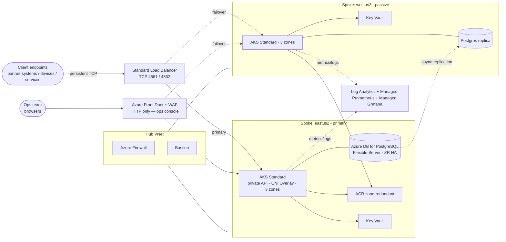

# WorkshopPlus — Replatforming a Real-Time Messaging System to AKS

> A **guided, instructor-led WorkshopPlus** delivered by a Microsoft SME (CSA / FastTrack Engineer / GBB). Participants are led, hands-on, through the **MVP replatform** of a legacy **socket-based real-time messaging system** (Java + C/C++ on RHEL VMs with a PostgreSQL backend) onto **containers running on Azure Kubernetes Service**, tuned for the latency, throughput, and availability profile that a real-time messaging platform demands.

> 🌐 **Microsite:** a static overview site lives in [`docs/`](docs/) and auto-deploys to **GitHub Pages** via [`.github/workflows/pages.yml`](.github/workflows/pages.yml). Enable it under **Settings → Pages → Build and deployment → Source: GitHub Actions**.

**Format.** Instructor + cohort (recommended 6–12 participants). Each participant on their own laptop with their own lab subscription / sandbox. The trainer drives the narrative, demos the hard parts on a shared screen, and unblocks individuals on Teams chat or breakouts.

**Entry level:** L200 — participants have provisioned an AKS cluster at least once and used `kubectl`.
**Exit target:** L300 across the WAF AKS pillars + **practical fluency** in replatforming a stateful, connection-oriented Linux workload. L400 stretch lanes flagged per module.

---

## The scenario in one paragraph

The customer (a real-time messaging operator) runs a 20-year-old messaging platform built around a custom framed wire protocol: a Java **socket gateway** that holds **long-lived TCP connections** to client endpoints, a **C/C++ message parser** reached over **HTTPS (REST/JSON)** that decodes the wire format and applies routing rules, and a **PostgreSQL** instance that stores routing tables, message journals, and end-of-day reconciliation state. Today it runs on **RHEL VMs** in their own datacentres, scaled vertically, patched in-place, and failed over by hand. The board has approved a 12-month modernization. **This workshop covers the MVP** — the first vertical slice that proves the architecture on Azure, runs against a synthetic but realistic load, and is good enough to onboard a real client partner for a controlled pilot.

Full brief: [SCENARIO.md](SCENARIO.md).

---

## Terminology — read this first

Kubernetes words are reserved for Kubernetes objects in this repo:

| Term | Means | NOT |
|---|---|---|
| **Pod** | A Kubernetes Pod | Anything else |
| **Container** | A Kubernetes container running inside a Pod | Azure Container Registry, Azure Container Apps, or a Docker container on your laptop — those are spelled out in full |
| **Node** | A Kubernetes Node (a VM in an AKS node pool) | Node.js — written out as **Node.js** when we mean the runtime |
| **Cluster** | A Kubernetes (AKS) Cluster | Any non-Kubernetes cluster |
| **`gateway-java`** | The Java socket gateway service (proper name) | A Kubernetes Node |
| **`parser-cpp`** | The C++ message parser worker (proper name) | — |
| **Connection** | A long-lived TCP/WebSocket socket from a client endpoint to the gateway | An HTTP request |

---

## What the cohort builds together

- A **hub-spoke** network across two Azure regions (eastus2 primary, westus3 passive)
- A **private, zone-redundant AKS Cluster** in each region with Istio service mesh, Workload Identity, and Key Vault CSI
- The **replatformed messaging stack**:
  - `gateway-java` — Java socket gateway (TCP + WebSocket), session-affine, holding ~10k concurrent client sockets per Pod
  - `parser-cpp` — C++ message parser (custom wire-format decoder), reached over HTTPS (REST/JSON), scaled by KEDA on queue depth
  - `ops-console` — React operator console (the only HTTP surface, fronted by Front Door + WAF)
  - **Azure Database for PostgreSQL — Flexible Server** as the journal/routing store (HA, zone-redundant)
- **GitOps** with Argo CD, deployment rings (dev → canary → prod) with a GitHub Actions gate
- **Observability** via Log Analytics + Managed Prometheus + Managed Grafana, with production-grade SLIs (message round-trip latency P99, socket churn, parser backlog)
- **Chaos** experiments (Pod kill, Node drain, zone failure, region failover) executed against **live socket sessions**

---

## Workshop success criteria → modules

| # | Success criterion | Module(s) |
|---|---|---|
| 1 | Replatform the legacy socket workload into an MVP running on AKS | [M00 envisioning](modules/00-envisioning/README.md) → [M03 MVP go-live](modules/03-mvp-go-live/README.md) |
| 2 | Run an A/B test of a new parser version against live traffic | [M04 A/B testing](modules/04-ab-testing/README.md) |
| 3 | Promote changes through dev → canary → prod with gates and rollback | [M05 deployment rings](modules/05-deployment-rings/README.md) |
| 4 | Survive an **intrinsic** outage without dropping client sockets | [M06 intrinsic outage](modules/06-intrinsic-outage/README.md) |
| 5 | Survive an **extrinsic** outage with cross-region failover | [M07 extrinsic outage](modules/07-extrinsic-outage/README.md) |
| 6 | Pass the knowledge check and present the architecture back | [assessment/knowledge-check.md](assessment/knowledge-check.md) |

---

## Delivery shape

Three options — the trainer picks one when booking. Detailed timing per option lives in [TRAINER-GUIDE.md](TRAINER-GUIDE.md).

| Format | Calendar | Hands-on | Best for |
|---|---|---|---|
| **WorkshopPlus 3-day** | 3 consecutive days, 8 hr each | ~16 hr | Single team, intensive |
| **WorkshopPlus 5-day** | 1 module / day, 4 hr each | ~16 hr | Operating teams that can't be offline a full day |
| **Briefing + Lab** | 1-day briefing, self-paced lab to follow | ~4 hr live, ~14 hr async | Awareness across a larger audience |

The **Trainer Guide** drives any of the three from the same content.

---

## Roles in the room

| Role | Who | What they do |
|---|---|---|
| **Lead trainer** | Microsoft SME (CSA / FTE / GBB) | Drives the narrative, demos hard steps, owns the room |
| **Co-trainer / TA** | Second SME or partner | Unblocks individuals, monitors chat, runs the war-room view |
| **Participant** | Customer engineer (≤12 per cohort) | Owns their own lab subscription, executes every step |
| **Customer sponsor** | Architecture / SRE lead | Joins the daily readout, validates that the design maps to their reality |

---

## Repository layout

```
.
├── README.md                          # you are here
├── SCENARIO.md                        # the legacy → target system brief
├── TRAINER-GUIDE.md                   # facilitator runbook (timing, talk tracks, demo cues)
├── LAB-GUIDE.md                       # participant walkthrough (mirrors trainer agenda)
├── prerequisites.md                   # what each participant installs/provisions before day 1
├── modules/                           # one folder per module with the lab steps
│   ├── appendix-a-intro-to-aks/       # L200 primer: containers → Kubernetes → AKS (prerequisite)
│   ├── 00-envisioning/                # legacy assessment + Day-0 decisions + ADR
│   ├── 01-platform-foundation/        # Terraform, OIDC, hub-spoke, AKS x2
│   ├── 02-cluster-hardening/          # Workload Identity, Key Vault CSI, Istio, policy
│   ├── 03-mvp-go-live/                # build, push, GitOps, first live socket session
│   ├── 04-ab-testing/                 # parser v2 alongside v1 via Istio
│   ├── 05-deployment-rings/           # dev → canary → prod with PR + manual sync gates
│   ├── 06-intrinsic-outage/           # connection-storms, bad parsers, zone drains
│   ├── 07-extrinsic-outage/           # cross-region failover for stateful sockets
│   └── 08-optimization/               # right-size, spot, KEDA, low-latency tuning
├── infra/terraform/                   # all IaC (hub-spoke, AKS, ACR, KV, observability, Front Door, Postgres)
├── apps/                              # the replatformed services
│   ├── gateway-java/                  # Java socket gateway (TCP + WebSocket)
│   ├── parser-cpp/                    # C++ message parser worker (custom wire-format decoder)
│   └── ops-console/                   # React operator console (the only HTTP surface)
├── k8s/                               # base manifests + dev / canary / prod overlays
├── gitops/                            # Argo CD app-of-apps + ring definitions
├── chaos/                             # Chaos Studio + manual experiments
├── scripts/                           # preflight + smoke + private-AKS helpers
└── assessment/                        # final knowledge check + self-grading rubric
```

---

## Target architecture (end state)



---

## Conventions used in module guides

Each module's `README.md` follows the same shape so the trainer can pace the room consistently:

1. **Outcomes** — what the participant will be able to do
2. **Where this fits in the replatform story** — how this module connects to the legacy → target journey
3. **Level target** — L300 baseline + L400 stretch
4. **Talk track** *(trainer)* — the 5–10 min framing the SME delivers before hands-on
5. **Demo cues** *(trainer)* — what the SME shows on the shared screen vs what participants run themselves
6. **Participant steps** — copy-pasteable commands
7. **Validation** — how participants prove it worked
8. **Stretch (L400)** — optional deeper dives, useful when individuals finish early
9. **Cleanup** — only explicit between modules; full teardown lives in the final module

---

## Getting started (instructor)

1. Read [TRAINER-GUIDE.md](TRAINER-GUIDE.md) end-to-end and pick the delivery format.
2. Send participants [prerequisites.md](prerequisites.md) **at least 5 business days** before the session.
3. The day before, dry-run [`scripts/preflight.sh`](scripts/preflight.sh) yourself on a fresh laptop and time it.
4. Day 1, open [LAB-GUIDE.md](LAB-GUIDE.md) on the projector — that's the cohort's shared map.

## Getting started (participant)

1. Complete every check in [prerequisites.md](prerequisites.md).
2. Run `./scripts/preflight.sh` and confirm every line is `[PASS]`.
3. Skim [SCENARIO.md](SCENARIO.md) so the brief is in your head before day 1.
4. Wait for the trainer; do not run any `terraform apply` ahead of the group.

## License

MIT. Sample code and infrastructure are for instructor-led training only — **not** production-hardened beyond what each module explicitly covers.
