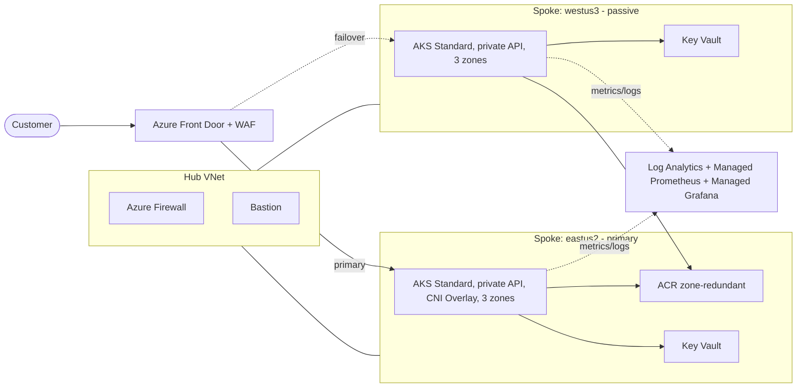

# Enterprise-Scale AKS — In Real Life (IRL)

> A self-paced lab that takes you from a **napkin sketch** to a **live customer** on AKS, then through A/B testing, deployment rings, surviving intrinsic and extrinsic outages, optimization, and a final knowledge check.

**Format.** One learner, one desktop, one Azure learning subscription. No facilitator, no group work, no time pressure.

**Entry level:** L200 (you've created a Cluster, deployed a Pod, used `kubectl`).
**Exit target:** L300 across the WAF AKS pillars; L400 stretch goals are flagged inside each module.

## Terminology — read this first

Kubernetes words are reserved for Kubernetes objects in this repo:

| Term | Means | NOT |
|---|---|---|
| **Pod** | A Kubernetes Pod | Anything else |
| **Container** | A Kubernetes container running inside a Pod | Azure Container Registry, Azure Container Apps, or a Docker container on your laptop — those are spelled out in full |
| **Node** | A Kubernetes Node (a VM in an AKS node pool) | Node.js — written out as **Node.js** when we mean the runtime |
| **Cluster** | A Kubernetes (AKS) Cluster | Any non-Kubernetes cluster |
| **`api-node`** | The Node.js sample API service (proper name) | A Kubernetes Node |

## What you build

- A hub-spoke network across two regions (eastus2 primary, westus3 passive)
- A private, zone-redundant AKS Cluster in each region with Istio service mesh, Workload Identity, Key Vault CSI
- A polyglot sample app (Node.js API, Python worker, React frontend) behind Azure Front Door + WAF
- GitOps with Argo CD, deployment rings (dev → canary → prod) with a GitHub Actions gate
- Observability via Log Analytics + Managed Prometheus + Managed Grafana
- Chaos experiments (Pod kill, Node drain, zone failure, region failover)

## Success criteria → mapped modules

| # | Success criterion | Module(s) |
|---|---|---|
| 1 | Take an MVP from napkin to live customer | [modules/00-envisioning](modules/00-envisioning/README.md) → [modules/03-mvp-go-live](modules/03-mvp-go-live/README.md) |
| 2 | Add A/B testing | [modules/04-ab-testing](modules/04-ab-testing/README.md) |
| 3 | Add deployment rings with gates | [modules/05-deployment-rings](modules/05-deployment-rings/README.md) |
| 4 | Survive an **intrinsic** outage | [modules/06-intrinsic-outage](modules/06-intrinsic-outage/README.md) |
| 5 | Survive an **extrinsic** outage | [modules/07-extrinsic-outage](modules/07-extrinsic-outage/README.md) |
| 6 | Pass the knowledge check | [assessment/knowledge-check.md](assessment/knowledge-check.md) |

## Estimated time

The full lab is about **14–18 hours of hands-on work**. Most of that is `terraform apply`, builds, and chaos experiments — you can leave long-running steps in the background.

| Module | Hands-on | Wall-clock (incl. apply waits) |
|---|---|---|
| M00 — Envisioning | 30 min | 30 min |
| M01 — Platform foundation | 30 min | 60 min (Terraform applies) |
| M02 — Cluster hardening | 45 min | 45 min |
| M03 — MVP go-live | 90 min | 2 hr |
| M04 — A/B testing | 60 min | 75 min |
| M05 — Deployment rings | 60 min | 80 min |
| M06 — Intrinsic outage | 75 min | 90 min |
| M07 — Extrinsic outage | 60 min | 90 min (failover timing) |
| M08 — Optimization | 30 min | 45 min |
| Knowledge check | 25 min | 30 min |

You can split this across multiple sittings. The Cluster will sit happily idle if you scale the user node pool to `min = 1` (instructions in M08).

## Repository layout

```
.
├── README.md                          # you are here
├── prerequisites.md                   # what to install/provision before you start
├── LAB-GUIDE.md                       # ordered, self-paced walkthrough
├── modules/                           # one folder per module with the lab steps
│   ├── 00-envisioning/
│   ├── 01-platform-foundation/
│   ├── 02-cluster-hardening/
│   ├── 03-mvp-go-live/
│   ├── 04-ab-testing/
│   ├── 05-deployment-rings/
│   ├── 06-intrinsic-outage/
│   ├── 07-extrinsic-outage/
│   └── 08-optimization/
├── infra/terraform/                   # all IaC (hub-spoke, AKS, ACR, KV, observability, Front Door)
├── apps/                              # polyglot sample app (one Pod per service in K8s)
│   ├── api-node/                      # Node.js REST API (the name is the app, not a K8s Node)
│   ├── worker-python/                 # Python background worker (KEDA-scaled)
│   └── web-react/                     # React frontend
├── k8s/                               # raw manifests + kustomize overlays
│   ├── base/
│   └── overlays/{dev,canary,prod}/
├── gitops/                            # Argo CD app-of-apps, ring definitions
├── chaos/                             # Chaos Studio + manual experiments
├── .github/workflows/                 # CI: build, scan, push to ACR, bump GitOps
└── assessment/                        # final knowledge check + self-grading rubric
```

## Architecture (target end state)



## Conventions used in module guides

Each module's `README.md` follows the same shape:

1. **Outcomes** — what you'll be able to do
2. **Level target** — L300 baseline + L400 stretch
3. **Steps** — copy-pasteable commands
4. **Validation** — how you know it worked
5. **Stretch (L400)** — optional deeper dives
6. **Cleanup** — only at the end of the lab; in-module cleanups are explicit

## Getting started

1. Read [prerequisites.md](prerequisites.md) and complete the **pre-flight** checks.
2. Skim [LAB-GUIDE.md](LAB-GUIDE.md) for the ordered walkthrough.
3. Provision the remote-state storage account: `terraform -chdir=infra/terraform/bootstrap init && terraform -chdir=infra/terraform/bootstrap apply`.
4. Open [modules/00-envisioning/README.md](modules/00-envisioning/README.md) and start.

## License

MIT. Sample app and infrastructure are for training only — **not** production-hardened beyond what each module explicitly covers.
